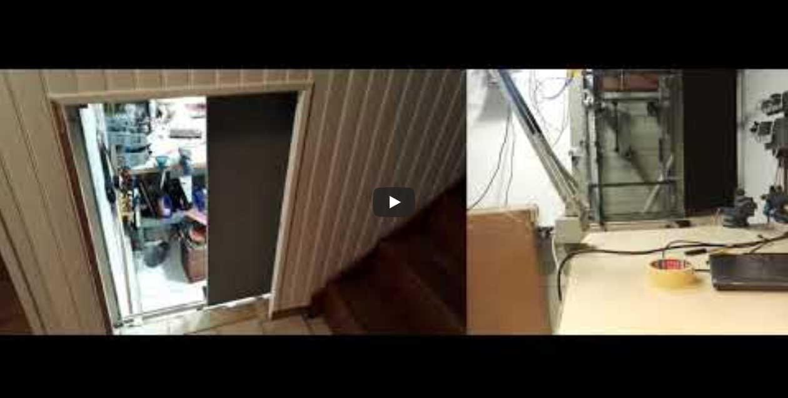
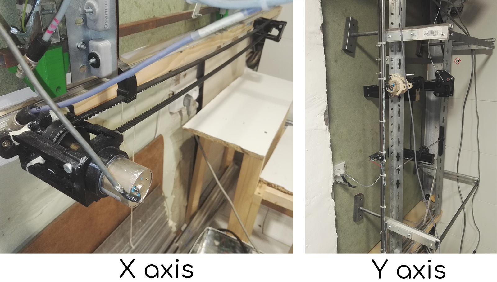
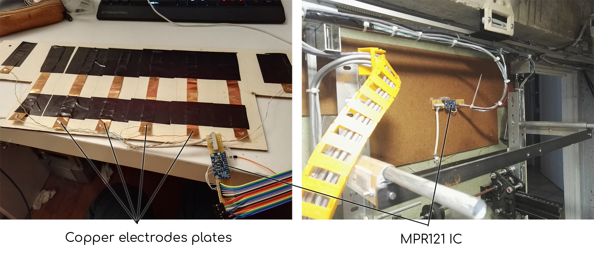

# Automated door & gesture triggers
Creation of an automatized door with a "sci-ficty" style opening system.

______________

30 seconds video overviewing the main features of the door, in action.

Automated door, with 2 axis linear movement, controlled by two brushed & gear reduced DC motors, and 2 sets of mechanical drives, with HTD timing belts and pulleys, and custom designed and 3D printed cogs and racks.

The longest axis is rolling on cupboard door rails, while the shortest axis is moving with custom built and lubricated aluminum tube and rods sliding in each other, pushed by cog and rack system on 3 points (defining a plane), synchronized by a belt and pulleys.

Most of the mechanical parts driving the movements are 3D printed, while the structural elements are cut and drilled by hand from raw aluminum and steel stocks available at local store.

CAD representation of some parts that have been used for this project.

The door opening is triggered either by pushing one of the 4 endstops, when inside the room, or by **sweeping from left to right** the hand close to the top of the door.

This detection is made possible with the use of an integrated circuit that measures the capacitance between up to 8 channels, and a common reference.

With the use of large enough copper sheets as electrodes, disposed in a linear pattern, one can record the movement of objects one one axis as long as these objects participate with the electrode plates to create a "capacitive system".

Such a system is created by a which a couple of electrodes and a medium around or between them. The change of material of the medium changes the capacitive constant of the system. With a dielectric constant of 80 at ambient temperature, water electrical permittivity is very different than air, and the change from one material to the other induce a detectable capacitive change.

