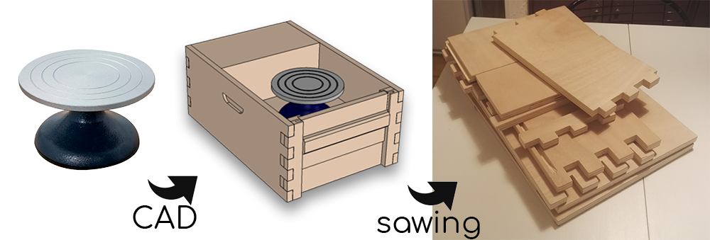
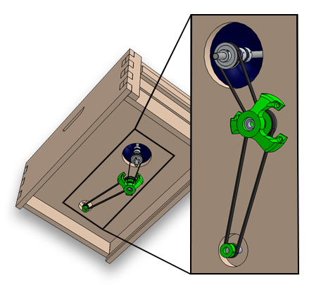
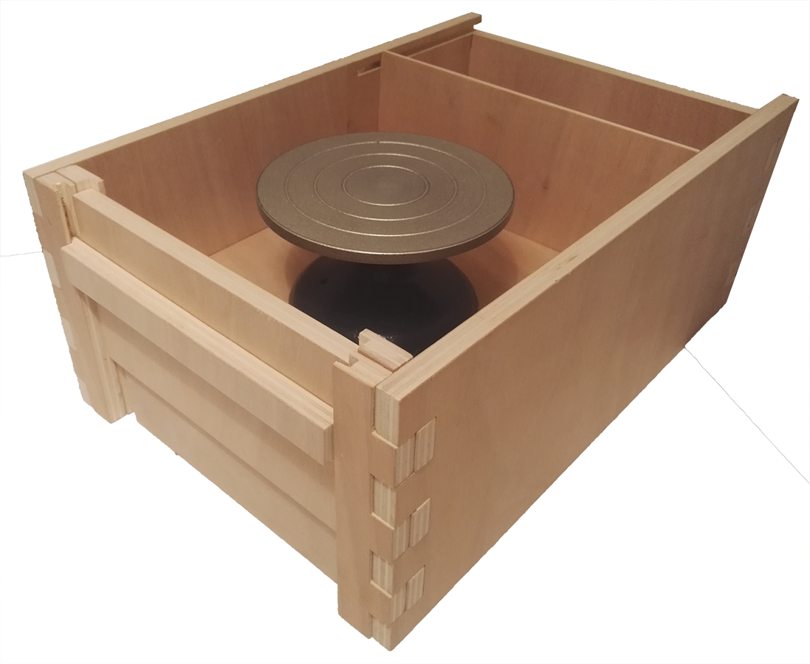
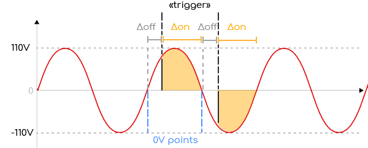

# Potter's Wheel : 

Homemade wood electrical potter's wheel with adjustable speed, with a "recycled" motor.

_____________

## Starting from a manual tour and a "scavenged" cooking mixer motor.

Starting with a cheap table potter's ["tournette"](https://loisir-creatif-fr.buttinette.com/shop/a/tournette-de-potier-11-x-18-cm-51128), I modeled an enclosure in thick plywood, with apertures to conveniently clean excess water and mud after clay work.

To motorize the wheel I decided to use an old asynchronous 220 V motor from a disposed mixer. The motor is running without load at 3600 rpm. I found that most potters wheel range up to 200 rpm. 

The reduction ratio for the belts and pulleys should then be about 18:1, at idle rotation. This reduction ratio also has a second benefit of increasing the output torque, preventing large speed changes as force is applied on the clay.

Using small pulleys at the common format GT2 and printing the other ones to match the given ratio, I obtained the load transmission assembly.

Once the whole building was complete, it was time to make the wheel speed driveable by a user.

## Speed control of an asynchronous motor without expensive variable frequency drive

To control an asynchronous motor speed, a possible & easy solution is to use Triacs and Phase detectors, to allow current to pass inside the motor in phase with the 50Hz oscillation of the grid. The goal is to delay more or less from the 0V point of the AC current, the point at which we start letting current pass in the motor, depending on how much energy we want to inject in it.

The energy received by the motor over time is then related to the area under the curve (in yellow in the graph below), from the timing at which we pull the "trigger" of the triac, to the next 0V point, at which the triac resets itself and cuts open the 220V circuit to the motor.

 

The measure of the phase of the 220V is done with an optocoupler linked to a microcontroller. (optocouplers are usually used when one wants to transmit signals from high voltage components to logic levels or reciprocally. They secure the material, as the signal is sent with light from a high voltage LED to a low voltage photodetector, thus the low and high voltage areas never meet.)

## A PID for stable speed control

To adjust speed in a stable manner with such control system, a PID is preferable. It can is set up by reading rotations at the output of the motor (before the gear reduction, for higher reading precision) and with an optical chopper wheel (3D printed works fine) an infrared LED and a photodiode. When the weel turns, the light beam is interrupted each time an obstructed part is on the way of the LED. The diode with the microcontroller measures each time the light is chopped, and the interval between two chops can be used to calculate the speed. Of course, the speed value update is more accurate with higher spinning value and a "dense" chopper.

The PID then will adjust the amount of energy sent into the motor for each half phase, depending on the proportional, integration and derivation of the speed control value (obtained from a potentiometer or a pedal (in which sits a linear variable resistance)) and the speed feedback value.