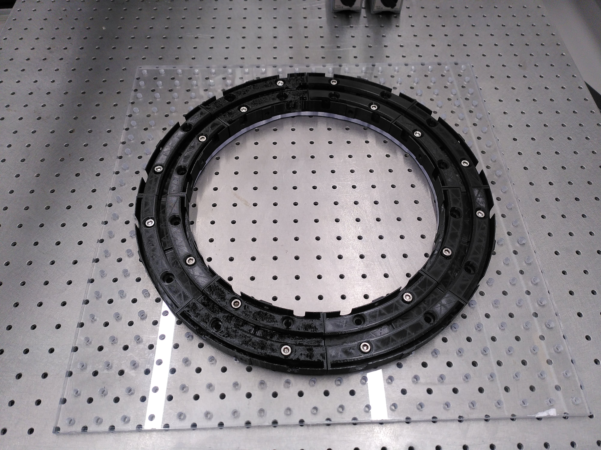

# Automated behavioral arena

Using actuators and sensors controlled with custom electronic hardware, and a custom PC acquisition system to perform fully automated and freely moving behavioral training to various tasks, in a 3D printed arena.

## In short :

To perform locomotion and tactile discrimination tasks, we developed and automated modular arena, that allows us to display various tactile stimuli and obstacles, and set their position automatically to train models to respond or interact depending on them.

In the second version of this arena, I made the outer circular corridors 8 identical modules that can be replaced easily to adapt with the evolution of the experimental design.

  
   

The central alley is transparent and thus, allows us to record high speed videography of models trajectories and whisker contacts, as displayed below, for two different types of tasks. 

On the left, it is an orientation discrimination task, with two sets of orientation possible, and a reward available after the stimulation, either on the right or left based on the stimuli.

On the right, it is an obstacle avoidance task, with two sets of "walls" that can exchange positions, or "disappear" between trials, to study sensory-motor adaptation.

The full automation of the tasks in the arena allows us to obtain better characterized and repeatable behaviors.

