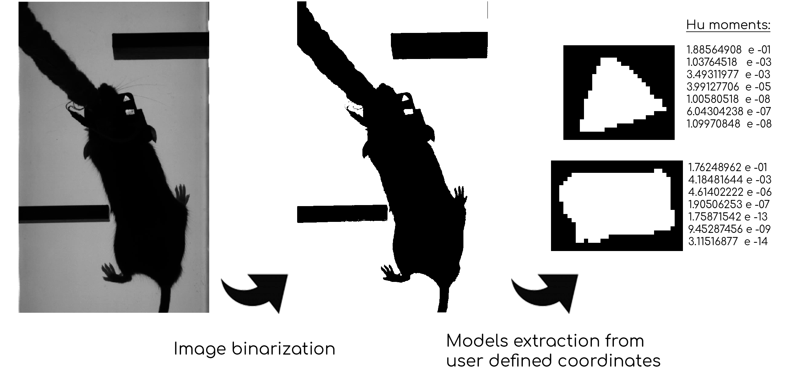
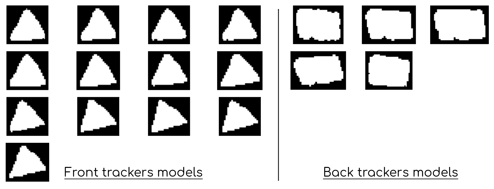
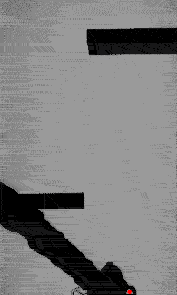

# Tracker shape based automated head tracking

Custom algorithm to detect multiple trackers with a semi-automated workflow, from high contrast infrared videos. First based on user input, building model of the trackers shapes, then in an automated way.

________

To extract precisely the position and orientation of items over time from large video datasets, I developed an interface that allows a user to define a number of trackers to identify and select one "model" for each tracker, to start the tracking.

The user is asked to identify other models of the same tracker by clicking at their position in the image, each time the algorithm fails to find a matching tracker with a good enough confidence, for one selected frame. The tracker characteristics (contour, area, position, shape descriptors) are then added to a list of valid items from which the one with the highest confidence to a given frame is used.

The calculation of the correspondence values between two shapes, an automatically detected putative marker and a valid item, is based on **hu-moment** values. These are seven values that are calculated from the contour coordinates of the binarized shape and are invariant to translation, rotation and scale.

Once a certain number of supplementary trackers are added, usually around a dozen, the algorithm can perform the detection  with a very good performance on it's own, under identical lighting conditions, as demonstrated below.

Overall, the user input phase is very short, for a set if similar videos, with 5 minutes on average.

