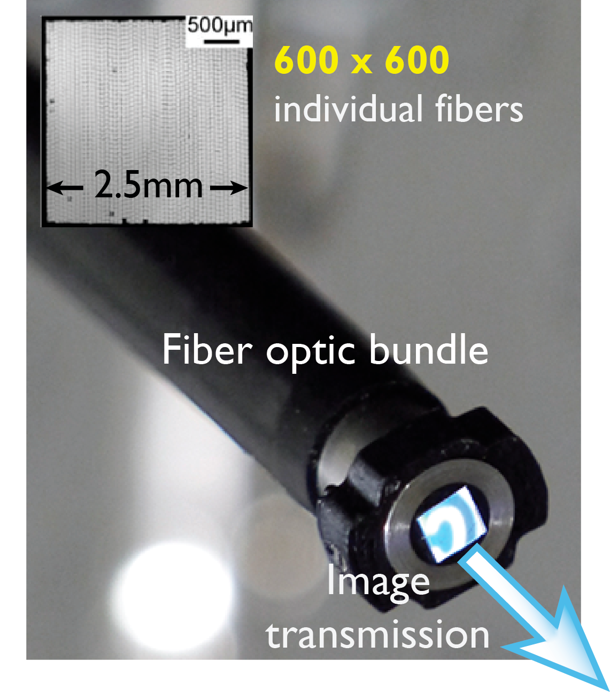
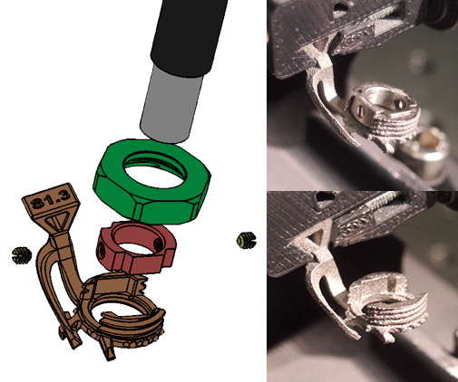
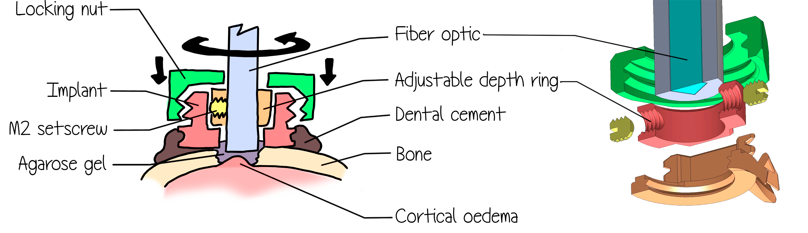
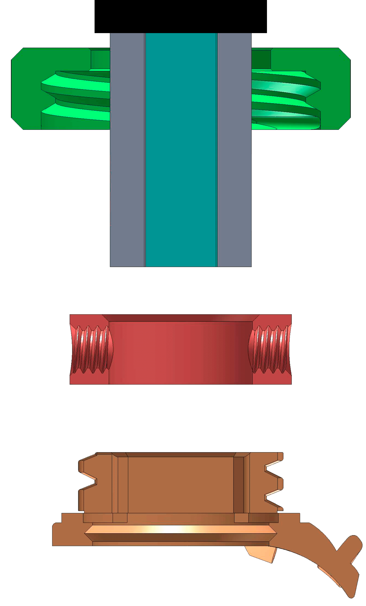

# Head implant for fluorescence imaging

Attaching a multi-core fiber optical image guide to freely behaving models.

## In short :

In my thesis with **Isabelle Ferezou** at **NeuroPSI**, I designed a miniature implant system to perform stable and precise **cortical** **imaging** at a **mesoscopic** scale, on **freely** **behaving** models.

Using a flexible **fiber optic bundle** illustrated below, we are able to record cortical fluorescence signals, while allowing models to behave freely.

Fiber optic bundle characteristics

We used **Voltage Sensitive Dye** RH1691, for which the variation of fluorescence measured during a synchronous populational activity is on the order of magnitude of **1%** **Δf/f**.

This implies that to maintain a good signal to noise ratio, we have to **prevent** even the **most subtle movements**, that can induce displacement artifacts on the fluorescence signals.

On the other hand, we have to **attach and detach easily** this optical image guide to perform daily training on several models. 

One last requirement that we had is to be able to perform surgeries prior to the imaging experiment, to be able to stain the cortex adequately with dyes. For this reason, the implant features opened sides, as can be seen in the image below.

The system that I developed , illustrated below, is designed with a **concentric fixation system** in a tight space, and with a tiny weight (1.2g).

Photograph of the implant held in the headpost

One the figure below, you can see a section-view of the implant components and a schematic representing how the elements sits onto the cortex during experimental conditions.

Schematic of the implant holding the fiber bundle over the cortex

 To lock the assembly, first, it is required to pass a loose <b>locking nut</b> through the <b>fiber optic bundle</b>.

Then, a tight fitted <b>ring</b> is fixed to the fiber optic end with a small M2 setscrew. The distance from the very tip of the fiber bundle and the adjustable ring sets the depth at which the fiber will sit on the cortex, once the assembly is fully locked.

Finally, the locking nut is screwed onto the implant and doing so, pushes the slightly over-heighted adjustable depth ring into the implant until it is fully locked.

Here, you can see animated the complete operation, in section view.

Animation displaying the fixation process in section view

Here is another representation to help picture the scale of the whole implant and fiber bundle with the skull of the model.

Implant and fiber elements at scale and in position over the model's skull

_____________

## Details :

The implant material is made from titanium, for it's high strength to weight ratio, and manufactured with 3D printing "laser sintering" technique, as well as good durability an low reactivity to chemical compounds.

| Material properties    | [Stainless Steel (304L)](http://asm.matweb.com/search/SpecificMaterial.asp?bassnum=MQ304L) | [Titanium (Ti-6Al-4V)](http://asm.matweb.com/search/SpecificMaterial.asp?bassnum=MTP642) | [Aluminum (7050)](http://asm.matweb.com/search/SpecificMaterial.asp?bassnum=MA7050T735) |
| ---------------------- | ------------------------------------------------------------ | ------------------------------------------------------------ | ------------------------------------------------------------ |
| Density                | 7.8-8 g/cm3                                                  | 4.43 g/cm3                                                   | 2.83 g/cm3                                                   |
| Modulus of Elasticity  | 200 GPa                                                      | 114 GPa                                                      | 71.1 GPa                                                     |
| Tensile Yield strength | 210 MPa*                                                     | 1100 MPa*                                                    | 434 MPa*                                                     |
| Elongation at Break    | 58%*                                                         | 10%                                                          | 12%                                                          |
| Hardness (Brinell)     | 158                                                          | 379                                                          | 132                                                          |

\*  *varies widely based on alloy & heat treatment*

<!--VSD awake staining : using high resolution SLA 3D printing with flexible resin to create liquid tight chamber.-->

<!--Protection across days : head cap made in plastic with markings to identify models.-->

